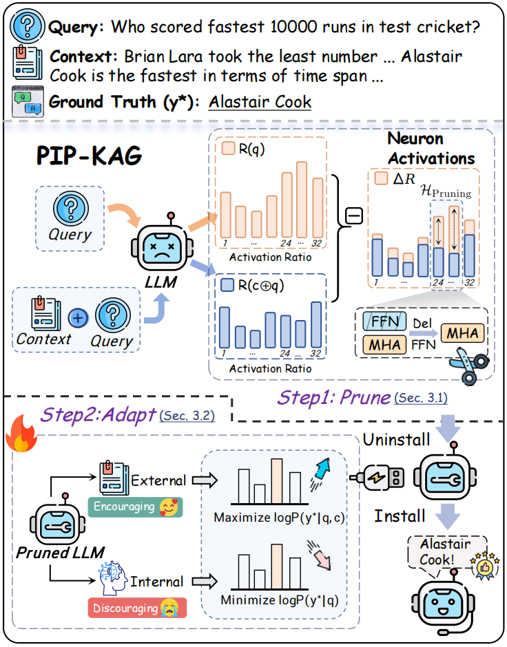
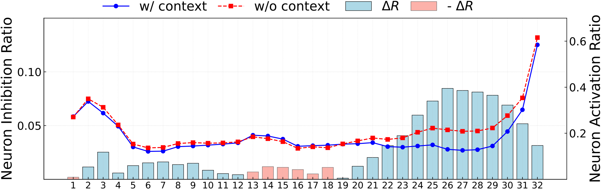

# PIP-KAG: Mitigating Knowledge Conflicts in Knowledge-Augmented Generation via Parametric Pruning


Source code for our paper: [PIP-KAG: Mitigating Knowledge Conflicts in Knowledge-Augmented Generation via Parametric Pruning](https://arxiv.org/pdf/2502.15543)

Click the links below to view our papers, checkpoints, and published models:

[](https://arxiv.org/pdf/2502.15543)
[](https://huggingface.co/chengpingan/PIP-KAG-7B)


If you find this work useful, please cite our paper and give us a shining star 🌟


## 🎯 Overview
We propose a ParametrIc Pruning-based Knowledge-Augmented Generation (PIP-KAG) approach, which prunes internal knowledge of LLMs and incorporates a plug-and-play adaptation module to help LLMs better leverage external sources. 

Experimental results on CoConflictQA demonstrate that PIP-KAG significantly reduces knowledge conflicts and improves context fidelity. Notably, PIP-KAG reduces LLM's parameters by 13%, enhancing parameter efficiency in LLMs within the KAG framework.


## ⚙️ Usage Instructions
(1) Environment Setup Requirements:
- Ensure your system meets the necessary installation requirements.

(2) Download the Model and Adapter Files:
- Confirm that you have both the pre-trained model and the adapter files.

(3) Uninstall Knowledge in LLMs and Install the Adaptation Module:
- Uninstall knowledge from LLMs and install the adaptation module to enable the pruned model to better leverage external sources, following the guidelines provided below.

(4) Evaluate the Performance of PIP-KAG Models:
- Assess the effectiveness of the PIP-KAG models.

## 1️⃣ Setup
(1) Use `git clone` to download this project:
```
git clone git@github.com:OpenBMB/PIP-KAG.git
cd PIP-KAG
```
(2) Install the following packages using Pip or Conda under your environment
```
Python=3.10.16
torch=2.5.1
transformers==4.48.0.dev0
tqdm
trl==0.12.2
vllm==0.6.6.post1
accelerate==1.3.0
deepspeed==0.16.3
peft==0.14.0
```
(3) Install the modified `transformers`:
```
cd src/transformers
pip install -e .
```

## 2️⃣ Download the model and adapter files:
The training data and testing data can be downloaded from [CoConflictQA](https://huggingface.co/datasets/chengpingan/PIP-KAG). After downloading, place the files into the data directory using the following structure:
```
data/
├── train/
│   └── Training.jsonl          # Training data
└── test/
    ├── hotpotq_kc.jsonl     
    ├── NaturalQuestionsShort_kc.jsonl 
    ├── NewsQA_kc.jsonl        
    ...
```
Our trained model can be found in [`PIP-KAG-7B`](https://huggingface.co/chengpingan/PIP-KAG-7B).


## 3️⃣ PIP-Uinstall & PIP-Install
### PIP-Uninstall
After preparation, you can begin training the PIP-KAG model. The knowledge uninstallation process consists of two main steps:

(1) First step: Visualize the neuron inhibition ratio $\Delta R$ of the model to identify the layers selected for knowledge uninstallation $\mathcal{H}_\text{Pruning}$. Execute the following commands:
```
cd scripts
bash 1_pip_uninstall/visualize.sh
```
Running the commands mentioned above will yield the visualization results:

Based on the visualization results, define a value for $\alpha$ to determine which layers to prune.

(2) Second Step: Uninstall knowledge by pruning FFN sub-layers in $\mathcal{H}_\text{Pruning}$. Execute the following commands:
```
cd scripts
bash 1_pip_uninstall/pip_uninstall.sh
```
This operation will result in a `pruned model` with the knowledge uninstalled.

### PIP-Install

1. Enhance `pruned models'` ability to leverage external sources by initially training an adapter module, Lora.
```
cd scripts
bash 2_pip_install/pip_install.sh
```
2. Merge the weights of the adaptation module trained using Lora in the first step with the `pruned model`.
```
cd scripts
bash utils/merge_lora.sh
```

## 4️⃣ Evaluating PIP-KAG
You can evaluate the performance of PIP-KAG in two ways:

(1) Follow the scripts provided above to test your reproduced model using the test data located in `/data/eval`.

(2) Alternatively, you can directly download our pre-trained model from [`PIP-KAG-7B`](https://huggingface.co/chengpingan/PIP-KAG-7B). and run the evaluation without additional training.
After training the PIP-KAG model, you can test the performance of PIP-KAG with the test data provided in .

```
cd scripts
bash Evaluation/evaluate_coconflictqa.sh
```

## 📝 Citation
Please cite our paper if it's helpful to your work!
```
@misc{huang2025pipkagmitigatingknowledgeconflicts,
      title={PIP-KAG: Mitigating Knowledge Conflicts in Knowledge-Augmented Generation via Parametric Pruning}, 
      author={Pengcheng Huang and Zhenghao Liu and Yukun Yan and Xiaoyuan Yi and Hao Chen and Zhiyuan Liu and Maosong Sun and Tong Xiao and Ge Yu and Chenyan Xiong},
      year={2025},
      eprint={2502.15543},
      archivePrefix={arXiv},
      primaryClass={cs.CL},
      url={https://arxiv.org/abs/2502.15543}, 
}
```

## 📨 Contact
If you have questions, suggestions, and bug reports, please email:
```
hpc1449181552@outlook.com
```